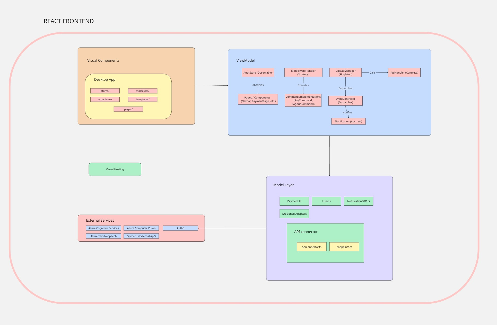

# EchoPay App

Members

- Luis Fernando Ureña Corrales - 2023064329
- Luis Alejandro Masís Pérez - 2017239616
- Nicole Tatiana Parra Valverde - 2023223291
- Danielo Wu Zhong - 2023150448

## Description:

EchoPay is a web-based and voice-based personal payment assistant that helps users manage, schedule, and execute recurring utility payments. It uses artificial intelligence to process natural language commands and integrates with banking APIs to ensure transaction security. The platform is designed for ease of use, security, and scalability.

## Stack:

**Frontend**:
-React
-Tailwind CSS
-TypeScript
**Backend**:
-Next.js  
**Database**:
-MSSQL Azure

## Frontend design specifications

### Authentication platform: Auth0

For the authentication platform, we have chosen Auth0 due to its robust features and ease of integration with web applications. Auth0 meets all the required criteria being:

- It supports login and password authentication, ensuring secure access to user accounts via JWTs.
- Auth0 provides automatic screen generation or an SDK for building custom login interfaces, making it easier to implement user authentication without building the system from scratch.
- Fully compatible with React and Next.js, enabling seamless integration into the frontend of the system.
- Auth0 offers API access to authenticate users programmatically, allowing us to validate and manage users without relying on the server-side session management.
- It supports Multi-Factor Authentication (MFA), ensuring a higher level of security. Additionally, Auth0 provides a sandbox environment that allows testing authentication flows, facilitating the development process.

---

### Demo Code:

To test how Auth0 works and how the login screen can be customized, a demo code was used based on the selected frontend technology: **Next.js with TypeScript**.

#### 1. Creating the Auth0 Application

An application was created in the [Auth0 Dashboard](https://manage.auth0.com/) with the following configuration:

- **Application Type:** Regular Web Application
- **Name:** DemoCode
- **Technology Stack:** Next.js

#### 2. Configuring Callback and Logout URLs

In the application settings, the following URLs were added:

- **Allowed Callback URLs:**  
  `http://localhost:3000/api/auth/callback`

- **Allowed Logout URLs:**  
  `http://localhost:3000`

- **Allowed Web Origins:**  
  `http://localhost:3000`

These settings allow proper redirection during the login and logout flows in development.

#### 3. Setting Up Environment Variables

The `.env.local` file was created in the root of the project with the necessary variables from Auth0:

- AUTH0_SECRET= secret-generated-with-openssl (or a random chain of characters)
- AUTH0_BASE_URL= http://localhost:3000
- AUTH0_ISSUER_BASE_URL= https://auth0-domain.auth0.com
- AUTH0_CLIENT_ID= client-id
- AUTH0_CLIENT_SECRET= client-secret

#### 4. Installing the Demo Code and Dependencies

The official Next.js demo code provided by Auth0 was used. After placing the code in the project folder, the following command was executed to install the dependencies:

- npm install

#### 5. Running the Application

To launch the app in development mode, the following command was executed:

- npm run dev

This started the development server on http://localhost:3000.

#### 6. Testing the Authentication Flow

The demo application includes login and logout buttons. When clicking the Login button, the app redirects the user to the Auth0-hosted login screen. Upon successful authentication (by introducing the correct email and password or using a google account), the sistem asks the user for it's OTP(as a MFA authentication), then the user is redirected back to the application.

After logging in, user profile information is displayed, demonstrating that authentication was successful and session management is working correctly.

#### 7. Customizing the Auth0 Login Interface

Auth0 provides a hosted login page that can be customized directly from the Auth0 Dashboard. Here's how the customization process was carried out:

1. **Accessing the Universal Login Settings**

   From the Auth0 Dashboard:

   - Navigate to **Branding** > **Universal Login**.
   - Select the **Login** tab.

2. **Selecting the Customization Mode**  
   Auth0 offers two modes:

   - **Classic**: Allows full customization using custom HTML, CSS, and JavaScript.
   - **New Universal Login Experience**: A modern, streamlined experience with limited visual customization but easier to configure.

   For this demo, the **New Universal Login Experience** was used to keep the configuration simple and consistent with current best practices.

3. **Customizing the Login Page**

   - The logo and primary color were changed under **Branding > Universal Login > Advanced Options > Customize**.
   - Additional UI elements like the title, background color, and button style can be adjusted using the branding options.
   - If using **Classic**, a custom HTML template can be provided to fully style the login experience.

4. **Saving and Previewing**  
   After making the desired changes, the updated login screen was previewed and saved. When logging in from the local app, the changes were reflected immediately in the hosted login page.

---

### Postman Requests

You can view or import the full Postman collection for this flow here:  
[Postman Collection - Login Flow](https://www.postman.com/maintenance-cosmonaut-70125097/workspace/auth0-mfa-demonstation/collection/44091561-a8ed4c1a-0747-4ae7-92ac-774f1fe6ea03?action=share&creator=44091561)

#### Request 1

The first request initiates a login attempt by providing only the username and password in the request body. This is a standard initial step in many authentication flows. However, in this case, the response does not return an access token immediately. Instead, the response includes an error message indicating that multifactor authentication (MFA) is required.

The error field in the response contains the value mfa_required, and the description clearly states that "Multifactor authentication is required." This is a clear indicator that the Auth0 tenant has MFA enforcement enabled and correctly blocks access until the second authentication factor is verified.

In addition to the error, the response includes an MFA token. This token is not an access token and does not grant access to protected resources. Instead, it is a short-lived token that represents a pending MFA challenge. It must be included in a subsequent request, where the user will provide the second authentication factor (such as a one-time password from an authenticator app or another supported method).

Here's a breakdown of the query parameters:

- **`response_type=code`**: This specifies that the client expects an authorization code in response.
- **`client_id`**: The unique identifier for the application in Auth0.
- **`redirect_uri`**: The URI where the user will be redirected after completing the login. This URI should match the one set up in the Auth0 application configuration.
- **`scope`**: Defines the permissions the application is requesting. In this case, the `openid`, `profile`, and `email` scopes are requested.
- **`audience`**: This refers to the API that the tokens will grant access to. In this case, it is the Payment Assistant API.

This request serves to confirm several things:

- That the system is enforcing MFA correctly.

- That users cannot authenticate using only a username and password.

- That the correct error and challenge flow is initiated by returning an mfa_token.

#### Request 2

The second request continues the MFA-enforced login flow by completing the MFA challenge. After the first request returns an `mfa_token`, this request submits that token along with a valid one-time password (OTP) generated by the user’s authenticator app or other configured MFA method.

This request uses the custom grant type `http://auth0.com/oauth/grant-type/mfa-otp`, which is specific to Auth0's MFA flow. It verifies that the user has successfully passed the second authentication factor and, if successful, returns an `access_token` and `id_token`.

This is a critical step in the flow because it transitions the user from _pending MFA_ to _fully authenticated_, granting them access to the application or API.

**Request Body Parameters:**

- `grant_type`: Custom grant type for MFA OTP. Value: `http://auth0.com/oauth/grant-type/mfa-otp`
- `client_id`: The Client ID of the application registered in Auth0.
- `client_secret`: The application's client secret (only for confidential applications).
- `mfa_token`: The temporary token received in the previous step that represents a pending MFA challenge.
- `otp`: The one-time password generated by the user’s MFA device (e.g., Google Authenticator).

**Expected Successful Response:**

json:
{
"access_token": "eyJz93a...k4laUWw",
"id_token": "eyJhbGciOiJSUzI1NiIsInR5cCI6IkpXVCJ9...",
"expires_in": 86400,
"token_type": "Bearer"
}

**Key Points:**

- This request completes the MFA challenge successfully.
- It issues a valid access_token and id_token.
- The user is now fully authenticated and can access protected resources.
- This confirms the MFA flow is working as expected with OTP-based authentication.

#### Request 3

The third request is for a complete the authentication flow by exchanging a **verification code** for tokens. This is a crucial step in the **Authorization Code Flow** with Auth0, a commonly used method for secure user authentication in production environments. The purpose of this request is to exchange the authorization code obtained from the user’s successful login and Multi-Factor Authentication (MFA) for the necessary tokens that will be used to authorize subsequent API requests and provide user-related information.

The request is made to Auth0's `/oauth/token` endpoint with the following fields in the body:

- **`grant_type`**: Set to `authorization_code`. This indicates that the client is attempting to exchange an authorization code for an access token. This step is part of the **Authorization Code Flow**, which is one of the most secure OAuth 2.0 flows.
- **`code`**: This is the verification code received after the user successfully completes the MFA challenge. It is a one-time use code that was generated by Auth0 during the authorization phase.
- **`redirect_uri`**: This must be the same as the redirect URI used during the authorization request, and it must match what has been configured in the Auth0 dashboard. This ensures that the request is legitimate and not being tampered with.
- **`client_id`** and **`client_secret`**: These are the credentials of the application. They are used to identify and authenticate the app to Auth0. The `client_id` uniquely identifies the app, while the `client_secret` is used to prove that the request is coming from the actual app and not from an attacker.

This verification code (`code`) is obtained through the following process:

1. **Start the development server**:

   - You need to start the server with the command `npm run dev`. This will run the application locally and allow you to proceed with the authentication flow.

2. **Open the Auth0 authorization URL**:
   - In the browser, open the following URL, which is Auth0’s authorization endpoint. This URL includes all the necessary parameters for the initial authentication request:

<https://dev-5dp1b6y0xuwqglt1.us.auth0.com/authorize?response_type=code&client_id=vC5teCwmKnpZA7cnybb87RXCaRwCoLPL&redirect_uri=http://localhost:3000/auth/callback&scope=openid%20profile%20email&audience=https://payment-assistant-api.com>

3. **Login using the test user**:

- Once the page loads, log in using the **test credentials** provided for this example:
  - **Email**: `danielowu1012@gmail.com`
  - **Password**: `b-uvWDqu3XJBuUY`
    But, using the gmail login also works due to the need of the OTP.

The user will be prompted to enter these details. After successful login, MFA will be triggered.

4. **Multi-Factor Authentication (MFA)**:

- After entering the username and password, the user will be prompted for the **One-Time Password (OTP)** as part of the MFA challenge. This is a security measure to verify the identity of the user.
- The OTP is typically sent via an authentication app (like Google Authenticator or Auth0’s Guardian app), or via email/SMS depending on the MFA setup.

5. **Redirection after successful MFA**:

- Once the MFA challenge is completed successfully, Auth0 will redirect the user to the callback URL configured in the initial authorization request.
- The URL will look similar to:

http://localhost:3000/auth/callback?code=9ax_OG55k8he0RWWtbTZ9epTawbkrQXRJULdvBE-lIKsf

- The key part here is the **`code`** parameter, which is the **authorization code** needed to complete the authentication process.

6. **Copy the `code` value**:

- From the URL, copy the value of the `code` parameter and paste it into the body of the token request, replacing `<verification code>`. This code is valid for a short period and is used to request tokens from the `/oauth/token` endpoint.

7. **Making the Token Request**:

- With the authorization code, you can now make the token request to Auth0’s `/oauth/token` endpoint. The request body will contain the following:
  - **`grant_type=authorization_code`**: Indicates this is an Authorization Code flow request.
  - **`code=<verification code>`**: The verification code obtained from the redirection URL.
  - **`redirect_uri=http://localhost:3000/auth/callback`**: Must match the `redirect_uri` used during the initial authorization step.
  - **`client_id` and `client_secret`**: the app’s client credentials.

8. **Successful Authentication Response**:

- If everything is set up correctly and the request is valid, Auth0 will respond with a payload containing several important pieces of information:
  - **`access_token`**: This token is used to authorize API requests. It must be included in the authorization header of subsequent API calls.
  - **`id_token`**: This token contains information about the authenticated user, such as their name, email, and other profile details.
  - **`scope`**: The permissions granted to the application, which are defined during the authorization request. In this case, the scopes are `openid`, `profile`, and `email`.
  - **`expires_in`**: The time in seconds until the access token expires.
  - **`token_type`**: Typically set to `Bearer`, indicating that the token is a bearer token.

9. **Outcome**:

- After receiving the access token and id token, the client application can use them to authenticate API requests and gain access to protected resources. This confirms that the user has been successfully authenticated using the **Authorization Code Flow** with MFA.

This step ensures that the authentication flow, including both password-based login and multi-factor authentication, is working properly. By using the verification code, the client can securely obtain tokens that are required for subsequent interactions with protected resources.

---

## Client Architecture:

EchoPay will follow an N-layer architecture, as it utilizes APIs to separate concerns between the presentation layer (frontend), the business logic (backend), and data access (database).

Technology used to implement this architecture:

- Frontend: React + TypeScript + Tailwind CSS
- Backend: Next.js API Routes
- Database: Azure MSSQL

This architecture allows for better modularity, scalability, and maintainability, and it facilitates future integration with other clients such as mobile applications.

#### Web App Rendering:

EchoPay will primarily use Client-Side Rendering (CSR) to provide a fast and interactive user experience.
However, since the system uses Next.js, Server-Side Rendering (SSR) can also be applied selectively for specific pages where SEO or initial load performance is a concern.

## Visual Components

#### Patterns & Principles

To design and build the visual components of EchoPay, we will follow the following patterns and principles, adapted to our stack (React + Tailwind + TypeScript):

- SOLID (must):
  
  To enforce the Single Responsibility Principle across the entire frontend, we apply a project-wide rule: every file must have a clear, singular purpose, whether it's visual, logical, or structural.

We define the following conventions:

  1. Atoms should only handle visual rendering (no logic or state)

  2. Hooks like usePaymentHandler.ts must only manage business logic (not UI, not services)

  3. Services like paymentService.ts must only interact with external APIs (no logic, no state, no UI).
   
- DRY (must):

  In addition to creating shared components (InputField.tsx, Button.tsx) and utility hooks (useAuth.ts, useErrorHandler.ts), we define code duplication boundaries:

  1. Any piece of logic repeated more than once must be abstracted (e.g., validation, formatting)

  2. Shared logic lives in hooks/ or utils/

  3. Shared components live in atoms/ or molecules/.
   
- Separation of Concerns (must):

  1. Business logic is handled in hooks such as useAuth.ts and usePaymentHandler.ts.

  2. Presentation logic is handled in clean functional components (e.g., PaymentForm.tsx).

  3. Styling is managed using Tailwind utility classes, fully separated from logic and JSX structure.
   
- Responsive Design (must):

  All components are responsive using Tailwind CSS classes like grid-cols-1 md:grid-cols-2, etc.
For instance, templates/DashboardLayout.tsx defines grid/flex layouts that adapt to screen size.

- Atomic Design (all):

  1. Atoms: smallest elements, like Button.tsx, InputField.tsx, Label.tsx, with no internal layout

  2. Molecules: basic combinations, like TextInputWithLabel.tsx, CheckboxGroup.tsx, composed from atoms

  3. Organisms: sections composed of multiple molecules and atoms, like PaymentSection.tsx, but not entire forms

  4. Templates: layout skeletons (DashboardLayout.tsx)

  5. Pages: route-bound compositions (DashboardPage.tsx, PaymentPage.tsx).
   
- MVVM (React):

  1. View: JSX markup in pages like PaymentPage.tsx

  2. ViewModel: Hook-based logic (usePaymentHandler.ts)

  3. Model: Data types and service calls (types/Payment.ts, services/paymentService.ts)
   
- State Management Pattern (web):

  We will integrate Zustand as a lightweight yet robust state management framework. This allows shared state access across pages and components without prop drilling or context overload. Zustand is now used in:

  1. AuthContext.tsx (refactored)

  2. Navbar.tsx (reads user state)

  3. PaymentPage.tsx (reads state to validate access).

#### Toolkits and Standards

- Tailwind CSS: Tailwind CSS is the sole styling system used in every visual component.
- Storybook: It is configured for isolated development and documentation of atoms and molecules.
- Vercel: It is the deployment platform, taking advantage of Next.js integration.

## Object design patterns

## External Services

The following diagram illustrates how UI components in the EchoPay frontend communicate directly with external services for user experience, automation, and interaction.

**Description of Services:**

- **Auth0**
  Used for user authentication. React components handle login/logout and store tokens.
- **Azure Cognitive Services**
  Allows the user to give payment commands using voice. The voice is transcribed to text in real-time.
- **Azure Text-to-Speech**
  Reads back payment confirmations, enhancing accessibility.
- **Azure Computer Vision**
  Enables users to upload images of receipts or invoices. The system extracts relevant information like amount, date, and service.
- **Payments External APIs**
  Accessed from the frontend to automate service-related operations with external providers (e.g., electricity, water).

These services are invoked through client-side logic and are chosen based on their ability to integrate securely with frontend technologies like React.

## Project Structure

## Final FE architecture diagram

## **Backend Design Specifications**

### Proof of Concepts

**POC Step 1 – Handler Responsibilities (SOLID & Cohesion)**

- **Challenge faced:**  
  The original template used two handlers with undefined responsibilities and example logic, including inline middleware execution. This needed to be changed to comply with the Single Responsibility Principle.
- **Solution chosen:**  
  An AbstractHandler class was created to encapsulate middleware execution and error handling. Concrete handlers, such as getPaymentHandler and createPaymentHandler, inherit from this class and are limited to executing their specific business logic. The Template Method pattern was applied to standardize the request execution flow.
- **Advantages:**  
  This implementation centralizes error control and middleware handling, promotes reusability, and facilitates maintenance by allowing new handlers to be added cleanly and consistently.

**POC Step 2 – README.md Improvements**

- **Challenge faced:**  
  The initial README was very limited, only offering basic setup instructions. It didn’t explain the project structure or document common development issues.
- **Solution chosen:**  
  The README.md file was completely rewritten to include a clear guide on the project’s purpose, how to configure it locally, how to deploy it to AWS, and how to test it using Postman. Issues encountered during environment configuration and deployment (e.g., Git submodule conflicts, Serverless plugin problems) were documented along with their solutions.
- **Advantages:**  
  The updated README serves as a reference for new developers, improves overall system understanding, and reduces setup time by documenting real-world solutions.

**POC Step 3 – Logger Improvements (Design Pattern)**

- **Challenge faced:**  
  Using console.log directly didn’t allow for structured or reusable logging, nor was it suitable for cloud environments.
- **Solution chosen:**  
  An ILogger interface was defined, and a ConsoleLogger implementation was created to support log, info, and error levels with timestamp formatting. This logger is injected into services and repositories, applying the Strategy Pattern. It can easily be swapped out for another implementation, such as CloudWatch.
- **Advantages:**  
  The logger is now decoupled, extensible, and aligned with good development practices. It improves system traceability and facilitates monitoring in real deployments.

**POC Step 4 – Middleware Management (Optional & Mandatory)**

- **Challenge faced:**  
  The original template did not allow for flexible middleware definition. Everything was hardcoded inside each handler.
- **Solution chosen:**  
  A middleware interface was designed, and a dynamic execution chain was implemented within the AbstractHandler class. Some middleware, such as AuthMiddleware, is mandatory, while others, like LoggerMiddleware, are conditionally activated using an environment variable (USE_LOGGER). A safeguard was implemented to prevent multiple calls to next().
- **Advantages:**  
  This pattern allows chaining multiple middleware cleanly, enabling configuration by environment (development vs. production) and ensuring security and modularity.

**POC Step 5 – Repository Layer Improvements**

- **Challenge faced:**
  In the original template, handlers accessed the database directly, resulting in tight coupling and making testing and data source replacement difficult.
- **Solution chosen:**
  An IPaymentRepository interface was created to define the operations required by repositories. A concrete implementation, PaymentMSSQLRepository, was developed to connect to an Azure SQL database using stored procedures. Additionally, a PaymentService layer was added to handle business rules and normalize data before it is passed to the repository.
- **Advantages:**
  This abstraction enables testing without relying on a real database, facilitates changing the data source, and improves the backend structure overall.

**POC Step 6 – Deployment & Testing**

- **Challenge faced:**  
  The template did not include functional deployment examples or integration tests.
- **Solution chosen:**  
  The project was configured to use the Serverless Framework to deploy getPayments and createPayment Lambda functions on AWS. These functions were connected to an Azure SQL database via stored procedures. Postman was used to validate the complete flow from API call to database interaction.
- **Advantages:**  
  This complete deployment validates the system in a real environment, ensures end-to-end backend functionality, and documents integration between cloud services, Lambda functions, and persistent storage.

### **Postman Testing:**

A collection of API tests was created in Postman to verify the system's behavior. The tests include:

- GET /payments – Retrieves all payments stored in the database and verifies structure and status code.
- POST /payments (valid input) – Creates a payment with all required fields and verifies correct insertion.
- POST /payments (missing fields) – Sends an incomplete request to validate input validation and error response.
- Unauthorized access – Calls endpoints without authorization headers to confirm the authentication middleware blocks access.

You can access the Postman collection here.

- **Link:** [`Postman Collection`](https://www.postman.com/docking-module-geologist-85553284/workspace/echopay/collection/40779938-777c5020-cdaf-4e4e-84f0-f86897c5530c?action=share&creator=40779938)

This complete deployment validates the system in a real environment, ensures end-to-end backend functionality, and documents integration between cloud services, Lambda functions, and persistent storage.

### Backend Architecture

1. **REST, GraphQL, gRPC, Monolithic, or Monolithic-MVC?**  
   Usaremos una arquitectura Monolithic-MVC basada en REST utilizando las API Routes de Next.js. Esto nos permite tener todo el backend centralizado, pero bien organizado en capas (controladores, servicios, acceso a datos), lo cual facilita el mantenimiento sin complicar el despliegue ni el desarrollo colaborativo.

2. **Serverless, Cloud, On-Premise, or Hybrid?**  
   Elegimos una arquitectura Serverless en la nube, usando Vercel para desplegar el backend.  
   Esto elimina la necesidad de administrar infraestructura, escala automáticamente según el uso, y reduce costos en esta etapa temprana del proyecto.

3. **Service vs. Microservices?**  
   EchoPay usa una arquitectura de tipo Service (monolito modular). Todo el backend vive en una sola aplicación Next.js, organizada internamente por módulos.  
   Esta opción permite rapidez en el desarrollo y facilidad para colaborar en equipo. En caso de que el sistema crezca, esta estructura facilita una futura migración hacia microservicios si se vuelve necesario dividir responsabilidades por dominio.

4. **Event-Driven, Queues, Brokers, Producer/Consumer, Pub/Sub?**  
   EchoPay usará una arquitectura event-driven para manejar tareas que no necesitan respuesta inmediata, como:

- Confirmación de pagos
- Envío de notificaciones
- Registro de actividad del usuario

Se utilizará Azure Service Bus como broker de mensajes. Los servicios del backend actuarán como productores que envían eventos, y habrá consumidores que procesan esos eventos (por ejemplo, enviar un correo o guardar un log).
Se aplicarán los patrones Producer/Consumer y Pub/Sub, según el tipo de evento.

5. **API Gateway (Security & Scalability)?**  
   Se usará un API Gateway, principalmente por razones de seguridad y control.  
   La opción elegida es Azure API Management, ya que se alinea con el uso de Azure MSSQL y podría gestionar:

- Autenticación centralizada con Auth0
- Rate limiting
- Monitoreo de tráfico
- Manejo de errores y redirección

Esto mejora la escalabilidad del sistema y protege la API ante picos de uso o accesos no autorizados.

### Data Layer Design

This section outlines all critical decisions made in the design of the data access layer for the EchoPay system.

1. **Structural – Infrastructure, Architecture, DevOps, DataOps**

a) **Data Topology (OLTP, Master-Slave, Distributed, Replicated, Geo)**

The system is designed as an OLTP application using a single-region primary with geo-replication for resilience.

- **Cloud service technology: Azure SQL Database with geo-replication enabled.**
- **Design patterns: None applicable (infra-level decision).**
- **Class layers: Standard API → Service → Repository → DB.**
- **Policies: Geo-redundant backups; single-region primary; high-availability tier.**
- **Benefits: Reliable for OLTP workloads; ensures regional redundancy.**

b) **Big Data Repositories (Hive, Snowflake, etc.)**

Big data technologies are not required in the current scope of EchoPay, as the system focuses solely on real-time transactional data.

- **Cloud service technology: None used.**
- **Design patterns: Not applicable.**
- **Class layers: Not applicable.**
- **Policies: EchoPay does not manage analytical or big data pipelines.**
- **Benefits: Simplicity; reduced costs and complexity.**

c) **Relational vs Document Database**

A relational database was selected to support strong consistency and enforce structured financial data models.

- **Cloud service technology: Azure SQL (Relational).**
- **Design patterns: Repository, DAO.**
- **Class layers: Sequelize ORM on top of Azure SQL.**
- **Policies: Tables normalized; strict schema enforcement.**
- **Benefits: ACID transactions; ideal for structured financial data.**

d) **Tenancy, Access Permissions, Security**

We prioritized multi-level access control and secure handling of sensitive data using standard tools from Azure and Auth0.

- **Cloud service technology: Azure AD, Azure Key Vault, Auth0.**
- **Design patterns: Strategy (for roles/permissions), RBAC.**
- **Class layers: Middleware → Service → Policy Validator.**
- **Policies: JWT validation, RBAC on routes, secrets in Key Vault.**
- **Benefits: Fine-grained control; secure access management.**

e) **Recovery and Fault Tolerance**

Azure SQL was selected for its robust recovery features, including automated backups and geo-redundancy to handle unexpected failures.

- **Cloud service technology: Azure SQL (Auto backup + geo-replication).**
- **Design patterns: Retry logic.**
- **Class layers: Error Handler → Retry Logic → DB access.**
- **Policies: Point-in-time recovery, auto-failover, backup retention (30 days).**
- **Benefits: High availability; resilience to data loss.**

2. **Object-Oriented Design – Programming Layer**

a) **Transactions: Statements vs Stored Procedures**

We chose to manage transactions programmatically through Sequelize rather than stored procedures, keeping logic flexible and easier to maintain.

- **Cloud service technology: Azure SQL.**
- **Design patterns: Unit of Work.**
- **Class layers: API → Service Layer → Repository.**
- **Policies: Transactions handled via Sequelize; no stored procedures yet.**
- **Benefits: Safer multi-step operations; rollback support.**

b) **ORM Usage**

We adopted Sequelize ORM to streamline our database interactions, leveraging its model-based structure to simplify queries and data validation.

- **Cloud service technology: Sequelize ORM (Node.js).**
- **Design patterns: Active Record (via Sequelize), Repository.**
- **Class layers: Models → Repositories.**
- **Policies: Sequelize models for all entities; migration scripts maintained.**
- **Benefits: Simplifies database access; strong typing with TypeScript.**

c) **Layers for Mapping, Concurrency, Object Relations**

Our design separates object models and database interactions into distinct layers to improve maintainability and enable precise control over data transformation and validation.

- **Cloud service technology: Node.js serverless backend.**
- **Design patterns: DAO, MVC separation.**
- **Class layers: DTOs, Domain Models, ORM Models.**
- **Policies: DTO validation; service-to-entity mapping.**
- **Benefits: Clean separation of concerns; testable logic.**

d) **Connection Pooling**

Connection pooling is configured in Sequelize to manage concurrency efficiently, especially in a serverless environment where resource limits can fluctuate.

- **Cloud service technology: Sequelize + tedious driver.**
- **Design patterns: Singleton for DB Manager.**
- **Class layers: DB Manager → Sequelize.**
- **Policies: Max pool size configured.**
- **Benefits: Prevents connection overload; optimizes performance.**

e) **Caching**

Although not yet implemented, caching is planned using Azure Redis to enhance performance in high-read operations like transaction history lookup.

- **Cloud service technology: Azure Redis (planned).**
- **Design patterns: Cache-aside.**
- **Class layers: Cache Layer → Repository.**
- **Policies: TTL settings; cache invalidation.**
- **Benefits: Faster reads; reduced DB load.**

f) **Drivers: Native vs Interpreted**

We opted for the native tedious driver to ensure compatibility and reliability when interfacing with Azure SQL Server.

- **Cloud service technology: tedious MSSQL driver (native).**
- **Design patterns: Not applicable.**
- **Class layers: Sequelize ORM.**
- **Policies: Native driver for full MSSQL support.**
- **Benefits: Stable, well-supported SQL Server connectivity.**

g) **Data Design**

The data model is designed following normalization principles to reduce redundancy and ensure consistency across the database.

- **Cloud service technology: Azure SQL.**
- **Design patterns: Domain Modeling.**
- **Class layers: Sequelize Models.**
- **Policies: 3NF normalization; enforced relationships.**
- **Benefits: Prevents redundancy; maintains data consistency.**

## Architecture Design

## Architecture Compliance Matrix
